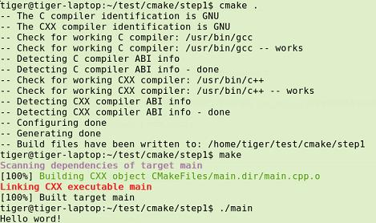
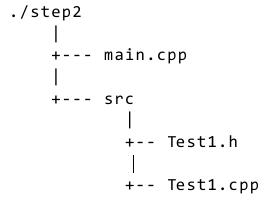
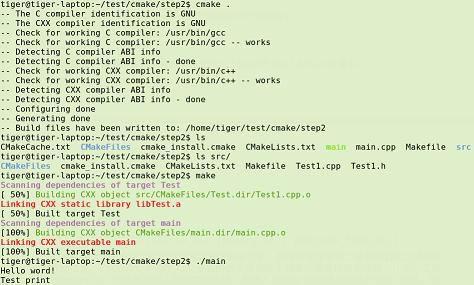
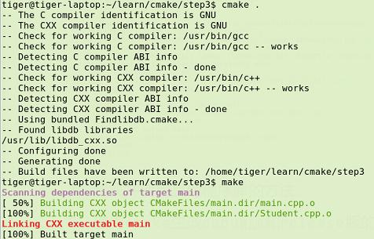
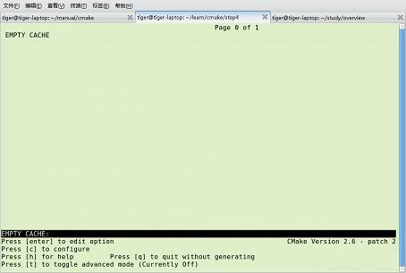
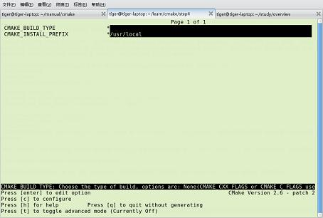

# CMake 用法详解
[TOC]
## 一、CMake 简介
&emsp;&emsp;CMake是一个跨平台的安装(编译)工具,可以用简单的语句来描述所有平台的安装(编译过程)。CMake 可以通过 CMakeLists.txt 文件来产生特定平台的标准的构建文件，例如：为 Unix 平台生成makefiles文件（使用GCC编译），为 Windows MSVC 生成 projects/workspaces（使用VS IDE编译）或Makefile文件（使用nmake编译）。能测试编译器所支持的C++特性,类似UNIX下的automake。

&emsp;&emsp;CMake的所有的语句都写在一个叫:CMakeLists.txt的文件中。当CMakeLists.txt文件确定后,可以用ccmake命令对相关 的变量值进行配置。这个命令必须指向CMakeLists.txt所在的目录。配置完成之后,应用cmake命令生成相应的makefile（在Unix like系统下）或者 project文件（指定用window下的相应编程工具编译时）。

&emsp;&emsp;在 linux 平台下使用 CMake 生成 Makefile 并编译的流程如下:
1. 编写 CmakeLists.txt。
2. 执行命令“cmake PATH”或者“ccmake PATH”生成 Makefile ( PATH 是 CMakeLists.txt 所在的目录 )。
3. 使用 make 命令进行编译。

## 二、CMake 基本语法
&emsp;&emsp;编写的CMakeLists.txt需要符合一定的语法规则，它主要由CMake命令组成。

**1）注释的语法**：在CMake中注释使用#字符开始到此行结束。
**2）CMake命令**：命令不区分大小写（参数会区分大小写），命令由命令、参数列表组成，参数之间使用空格进行分隔。使用一对双引号包括的字符串认为是一个参数。命令可以是一个内置命令（例如：project，add_executable等），也可以是一个用户定义的宏（macro）或者函数（function）。
**3）数据类型**：CMake的基本数据类型是字符串，一组字符串在一起称为列表（list），例如：

```
# 通过 set 命令构建一个 listVAR

set(VAR a b c)

使用语法 ${VariableName} 来访问名字为 VariableName 的变量的值（变量名区分大小写）。需要注意的是，即使在字符串中也可以使用 ${VariableName} 来访问变量的值：

set(VAR a b c)

# 输出 VAR = a;b;c

message("VAR = ${VAR}")

使用语法 $ENV{VariableName} 来访问环境变量的值（ENV{VariableName} 则表示环境变量本身）

# 输出环境变量 PATH 的值

message($ENV{PATH})
```
**4）条件控制和循环结构**

&emsp;&emsp;条件控制命令为 if 命令

```
if(expression)

    #...

elseif(expression2)

    #...

else()

    #...

endif()
```
&emsp;&emsp;对于 if(string) 来说：
&emsp;&emsp;如果 string 为（不区分大小写）1、ON、YES、TRUE、Y、非 0 的数则表示真
&emsp;&emsp;如果 string 为（不区分大小写）0、OFF、NO、FALSE、N、IGNORE、空字符串、以 -NOTFOUND 结尾的字符串则表示假
&emsp;&emsp;如果 string 不符合上面两种情况，则 string 被认为是一个变量的名字。变量的值为第二条所述的各值则表示假，否则表示真。

```
# 此策略（Policy）在 CMake2.8.0 才被引入

# 因此这里需要指定最低 CMake 版本为 2.8

cmake_minimum_required(VERSION 2.8)

set(YES 0)

# 输出 True

if(YES)

   message(True)

else()

   message(False)

endif()

# 输出 False

if(${YES})

   message(True)

else()

   message(False)

endif()
```
表达式中可以包含操作符，操作符包括：
一元操作符，例如：EXISTS、COMMAND、DEFINED 等
二元操作符，例如：EQUAL、LESS、GREATER、STRLESS、STRGREATER 等
NOT（非操作符）
AND（与操作符）、OR（或操作符）
操作符优先级：一元操作符 > 二元操作符 > NOT > AND、OR

**常用操作符介绍：**

```
if(NOT expression)
```
为真的前提是 expression 为假

```
if(expr1 AND expr2)
```
为真的前提是 expr1 和 expr2 都为真

```
if(expr1 OR expr2)
```
为真的前提是 expr1 或者 expr2 为真

```
if(COMMAND command-name)
```
为真的前提是存在 command-name 命令、宏或函数且能够被调用

```
if(EXISTS name)
```
为真的前提是存在 name 的文件或者目录（应该使用绝对路径）

```
if(file1 IS_NEWER_THAN file2)
```
为真的前提是 file1 比 file2 新或者 file1、file2 中有一个文件不存在（应该使用绝对路径）

```
if(IS_DIRECTORY directory-name)
```
为真的前提是 directory-name 表示的是一个目录（应该使用绝对路径）

```
if(variable|string MATCHES regex)
```
为真的前提是变量值或者字符串匹配 regex 正则表达式

```
if(variable|string LESS variable|string)

if(variable|string GREATER variable|string)

if(variable|string EQUAL variable|string)
```
为真的前提是变量值或者字符串为有效的数字且满足小于（大于、等于）的条件

```
if(variable|string STRLESS variable|string)

if(variable|string STRGREATERvariable|string)

if(variable|string STREQUALvariable|string)
```
为真的前提是变量值或者字符串以字典序满足小于（大于、等于）的条件

```
if(DEFINED variable)
```
为真的前提是 variable 表示的变量被定义了。

foreach 循环范例：

```
set(VAR a b c)

foreach(f ${VAR})

   message(${f})

endforeach()
```
while 循环范例：

```
set(VAR 5)

while(${VAR} GREATER 0)

   message(${VAR})

   math(EXPR VAR "${VAR} - 1")

endwhile()
```
**5）函数和宏定义**

函数会为变量创建一个局部作用域，而宏则使用全局作用域。范例：

```
# 定义一个宏 hello

macro(hello MESSAGE)

   message(${MESSAGE})

endmacro()

# 调用宏 hello

hello("hello world")

# 定义一个函数 hello

function(hello MESSAGE)

   message(${MESSAGE})

endfunction()
```
函数和宏可以通过命令 return() 返回，但是函数和宏的返回值必须通过参数传递出去。例如：

```
cmake_minimum_required(VERSION 2.8)

function(get_func RESULT)

    #RESULT 的值为实参的值，因此需要使用 ${RESULT}

    #这里使用 PARENT_SCOPE 是因为函数会构建一个局部作用域

   set(${RESULT} "Hello Function" PARENT_SCOPE)

endfunction()

macro(get_macro RESULT)

   set(${RESULT} "Hello Macro")

endmacro()

get_func(V1)

# 输出 Hello Function

message(${V1})

get_macro(V2)

# 输出 Hello Macro

message(${V2})
```
**6）字符串的一些问题**

&emsp;&emsp;字符串可跨行且支持转移字符，例如：

```
set(VAR "hello

world")

# 输出结果为：

# ${VAR} = hello

# world

message("\${VAR} = ${VAR}")
```
## 三、CMake 常用命令

这里介绍一下常用的命令（CMake 2.8 的命令可以在此查询）：

http://www.cmake.org/cmake/help/v2.8.8/cmake.html#section_Commands

**1）project 命令**

命令语法：project(<projectname> [languageName1 languageName2 … ] )

命令简述：用于指定项目的名称

使用范例：project(Main)

**2）cmake_minimum_required命令**

命令语法：cmake_minimum_required(VERSION major[.minor[.patch[.tweak]]][FATAL_ERROR])

命令简述：用于指定需要的 CMake 的最低版本

使用范例：cmake_minimum_required(VERSION 2.8)

**3）aux_source_directory命令**

命令语法：aux_source_directory( $<dir> <variable>$)

命令简述：用于将 dir 目录下的所有源文件的名字保存在变量 variable 中

使用范例：aux_source_directory(. DIR_SRCS)

**4）add_executable 命令**

命令语法：add_executable(<name> [WIN32] [MACOSX_BUNDLE][EXCLUDE_FROM_ALL] source1 source2 … sourceN)

命令简述：用于指定从一组源文件 source1 source2 … sourceN 编译出一个可执行文件且命名为 name

使用范例：add_executable(Main ${DIR_SRCS})

**5）add_library 命令**

命令语法：add_library([STATIC | SHARED | MODULE] [EXCLUDE_FROM_ALL] source1source2 … sourceN)

命令简述：用于指定从一组源文件 source1 source2 … sourceN 编译出一个库文件且命名为 name

使用范例：add_library(Lib ${DIR_SRCS})

**6）add_dependencies 命令**

命令语法：add_dependencies(target-name depend-target1 depend-target2 …)

命令简述：用于指定某个目标（可执行文件或者库文件）依赖于其他的目标。这里的目标必须是 add_executable、add_library、add_custom_target 命令创建的目标

**7）add_subdirectory 命令**

命令语法：add_subdirectory(source_dir [binary_dir] [EXCLUDE_FROM_ALL])

命令简述：用于添加一个需要进行构建的子目录

使用范例：add_subdirectory(Lib)

**8）target_link_libraries命令**

命令语法：target_link_libraries(<target> [item1 [item2 […]]][[debug|optimized|general] ] …)

命令简述：用于指定 target 需要链接 item1 item2 …。这里 target 必须已经被创建，链接的 item 可以是已经存在的 target（依赖关系会自动添加）

使用范例：target_link_libraries(Main Lib)

**9）set 命令**

命令语法：set(<variable> <value> [[CACHE <type><docstring> [FORCE]] | PARENT_SCOPE])

命令简述：用于设定变量 variable 的值为 value。如果指定了 CACHE 变量将被放入 Cache（缓存）中。

使用范例：set(ProjectName Main)

**10）unset 命令**

命令语法：unset(<variable> [CACHE])

命令简述：用于移除变量 variable。如果指定了 CACHE 变量将被从 Cache 中移除。

使用范例：unset(VAR CACHE)

**11）message 命令**

命令语法：message([STATUS|WARNING|AUTHOR_WARNING|FATAL_ERROR|SEND_ERROR] “message todisplay”…)

命令简述：用于输出信息

使用范例：message(“Hello World”)

**12）include_directories 命令**

命令语法：include_directories([AFTER|BEFORE] [SYSTEM] dir1 dir2 …)

命令简述：用于设定目录，这些设定的目录将被编译器用来查找 include 文件

使用范例：include_directories(${PROJECT_SOURCE_DIR}/lib)

**13）find_path 命令**

命令语法：find_path(<VAR> name1 [path1 path2 …])

命令简述：用于查找包含文件 name1 的路径，如果找到则将路径保存在 VAR 中（此路径为一个绝对路径），如果没有找到则结果为 <VAR>-NOTFOUND。默认的情况下，VAR 会被保存在 Cache 中，这时候我们需要清除 VAR 才可以进行下一次查询（使用 unset 命令）。

使用范例：

find_path(LUA_INCLUDE_PATH lua.h${LUA_INCLUDE_FIND_PATH})

if(NOT LUA_INCLUDE_PATH)

   message(SEND_ERROR "Header file lua.h not found")

endif()

**14）find_library 命令**

命令语法：find_library(<VAR> name1 [path1 path2 …])

命令简述：用于查找库文件 name1 的路径，如果找到则将路径保存在 VAR 中（此路径为一个绝对路径），如果没有找到则结果为 <VAR>-NOTFOUND。一个类似的命令 link_directories 已经不太建议使用了

**15）add_definitions 命令**

命令语法：add_definitions(-DFOO -DBAR …)

命令简述：用于添加编译器命令行标志（选项），通常的情况下我们使用其来添加预处理器定义

使用范例：add_definitions(-D_UNICODE -DUNICODE)

**16）execute_process 命令**

命令语法：

execute_process(COMMAND <cmd1>[args1...]]

                  [COMMAND <cmd2>[args2...] [...]]

                  [WORKING_DIRECTORY<directory>]

                  [TIMEOUT <seconds>]

                  [RESULT_VARIABLE<variable>]

                  [OUTPUT_VARIABLE<variable>]

                  [ERROR_VARIABLE<variable>]

                  [INPUT_FILE <file>]

                  [OUTPUT_FILE <file>]

                  [ERROR_FILE <file>]

                  [OUTPUT_QUIET]

                  [ERROR_QUIET]

                 [OUTPUT_STRIP_TRAILING_WHITESPACE]

                 [ERROR_STRIP_TRAILING_WHITESPACE])

命令简述：用于执行一个或者多个外部命令。每一个命令的标准输出通过管道转为下一个命令的标准输入。WORKING_DIRECTORY 用于指定外部命令的工作目录，RESULT_VARIABLE 用于指定一个变量保存外部命令执行的结果，这个结果可能是最后一个执行的外部命令的退出码或者是一个描述错误条件的字符串，OUTPUT_VARIABLE 或者 ERROR_VARIABLE 用于指定一个变量保存标准输出或者标准错误，OUTPUT_QUIET 或者 ERROR_QUIET 用于忽略标准输出和标准错误。

```
使用范例：execute_process(COMMAND ls)
```
**18）file 命令**

命令简述：此命令提供了丰富的文件和目录的相关操作（这里仅说一下比较常用的）

使用范例：

```
# 目录的遍历

# GLOB 用于产生一个文件（目录）路径列表并保存在variable 中

# 文件路径列表中的每个文件的文件名都能匹配globbing expressions（非正则表达式，但是类似）

# 如果指定了 RELATIVE 路径，那么返回的文件路径列表中的路径为相对于 RELATIVE 的路径

# file(GLOB variable [RELATIVE path][globbing expressions]...)

 

# 获取当前目录下的所有的文件（目录）的路径并保存到 ALL_FILE_PATH 变量中

file(GLOB ALL_FILE_PATH ./*)

# 获取当前目录下的 .h 文件的文件名并保存到ALL_H_FILE 变量中

# 这里的变量CMAKE_CURRENT_LIST_DIR 表示正在处理的 CMakeLists.txt 文件的所在的目录的绝对路径（2.8.3 以及以后版本才支持）

file(GLOB ALL_H_FILE RELATIVE${CMAKE_CURRENT_LIST_DIR} ${CMAKE_CURRENT_LIST_DIR}/*.h)
```

## 四、小试牛刀
&emsp;&emsp;在项目的根目录中创建目录 cmake/modules/ ，在 cmake/modules/ 下创建文件 Findlibdb_cxx.cmake ，内容如下：

现假设我们的项目中只有一个源文件 main.cpp

&emsp;&emsp;清单 1 源文件 main.cpp

```
1 #include<iostream>
2 
3 int main()
4 {
5     std::cout<<"Hello word!"<<std::endl;
6     return 0;
7 }
```
&emsp;&emsp;为了构建该项目,我们需要编写文件 CMakeLists.txt 并将其与 main.cpp 放在 同一个目录下:

&emsp;&emsp;清单 2 CMakeLists.txt

```
1 PROJECT(main)
2 CMAKE_MINIMUM_REQUIRED(VERSION 2.6)
3 AUX_SOURCE_DIRECTORY(. DIR_SRCS)
4 ADD_EXECUTABLE(main ${DIR_SRCS})
```
&emsp;&emsp;CMakeLists.txt 的语法比较简单,由命令、注释和空格组成,其中命令是不区分大小写的,符号"#"后面的内容被认为是注释。命令由命令名称、小括号和参数组成,参数之间使用空格进行间隔。例如对于清单2的 CMakeLists.txt 文件:第一行是一条命令,名称是 PROJECT ,参数是 main ,该命令表示项目的名称是 main 。第二行的命令限定了 CMake 的版本。第三行使用命令 AUX_SOURCE_DIRECTORY 将当前目录中的源文件名称赋值给变量 DIR_SRCS 。 CMake 手册中对命令 AUX_SOURCE_DIRECTORY 的描述如下:

```
1 aux_source_directory(<dir> <variable>)
```
&emsp;&emsp;该命令会把参数中所有的源文件名称赋值给参数 <variable>。 第四行使用命令 ADD_EXECUTABLE 指示变量 DIR_SRCS 中的源文件需要编译 成一个名称为 main 的可执行文件。完成了文件 CMakeLists.txt 的编写后需要使用 cmake 或 ccmake 命令生成Makefile 。 ccmake 与命令 cmake 的不同之处在于 ccmake 提供了一个图形化的操作界面。cmake 命令的执行方式如下:

```
1 cmake [options] <path-to-source>
```

&emsp;&emsp;这里我们进入了 main.cpp 所在的目录后执行 “cmake .” 后就可以得到 Makefile 并使用 make 进行编译,如下图所示。
 <div align=center> </div> <div align=center>图 1. CMake 的运行结果 </div>

## 五、处理多源文件目录的方法
 <div align=center> </div><div align=center>图 2. 源代码分布情况</div>
### Step 1 : 项目主目录中的 CMakeLists.txt
&emsp;&emsp;在目录 Step2 中创建文件 CMakeLists.txt 。文件内容如下:
&emsp;&emsp;清单 3 目录 Step2 中的 CMakeLists.txt

```
1 PROJECT(main)
2 CMAKE_MINIMUM_REQUIRED(VERSION 2.6) 
3 ADD_SUBDIRECTORY( src )
4 AUX_SOURCE_DIRECTORY(. DIR_SRCS)
5 ADD_EXECUTABLE(main ${DIR_SRCS}  )
6 TARGET_LINK_LIBRARIES( main Test )
```
&emsp;&emsp;相对于清单 2，该文件添加了下面的内容: 第三行，使用命令 ADD_SUBDIRECTORY 指明本项目包含一个子目录 src 。第六行，使用命令 TARGET_LINK_LIBRARIES 指明可执行文件 main 需要连接一个名为Test的链接库。
### Step 2 : 子目录中的 CMakeLists.txt
&emsp;&emsp;在子目录 src 中创建 CmakeLists.txt。文件内容如下:
&emsp;&emsp;清单 4. 目录 src 中的 CmakeLists.txt

```
1 AUX_SOURCE_DIRECTORY(. DIR_TEST1_SRCS)
2 ADD_LIBRARY ( Test ${DIR_TEST1_SRCS})
```
在该文件中使用命令 ADD_LIBRARY 将 src 目录中的源文件编译为共享库。

### Step 3 : 执行 cmake
&emsp;&emsp;至此我们完成了项目中所有 CMakeLists.txt 文件的编写,进入目录 Step2 中依次执行命令 “cmake .” 和 “make” 得到结果如下:
<div align=center></div>
<div align=center>图3. 处理多源文件目录时 cmake 的执行结果</div>
&emsp;&emsp;在执行 cmake 的过程中,首先解析目录 step2 中的 CMakeLists.txt ,当程序执行命令 ADD_SUBDIRECTORY( src ) 时进入目录 src 对其中的 CMakeLists.txt 进行解析。

## 六、在工程中查找并使用其他程序库的方法
&emsp;&emsp;在开发软件的时候我们会用到一些函数库,这些函数库在不同的系统中安装的位置可能不同,编译的时候需要首先找到这些软件包的头文件以及链接库所在的目录以便生成编译选项。例如一个需要使用博克利数据库项目,需要头文件db_cxx.h 和链接库 libdb_cxx.so ,现在该项目中有一个源代码文件 main.cpp ，放在项目的根目录中。
### Step 1 ： 程序库说明文件
在项目的根目录中创建目录 cmake/modules/ ，在 cmake/modules/ 下创建文件 Findlibdb_cxx.cmake ，内容如下：
清单 5. 文件 Findlibdb_cxx.cmake

```
1 MESSAGE(STATUS "Using bundled Findlibdb.cmake...")
2 FIND_PATH(
3 LIBDB_CXX_INCLUDE_DIR
4 db_cxx.h
5 /usr/include/
6 /usr/local/include/
7 )
8 FIND_LIBRARY(
9   LIBDB_CXX_LIBRARIES NAMES  db_cxx
10  PATHS /usr/lib/ /usr/local/lib/
11  )
```

&emsp;&emsp;文件 Findlibdb_cxx.cmake 的命名要符合规范: FindlibNAME.cmake ,其中NAME 是函数库的名称。Findlibdb_cxx.cmake 的语法与 CMakeLists.txt 相同。这里使用了三个命令： MESSAGE ， FIND_PATH 和 FIND_LIBRARY 。
&emsp;&emsp;命令 MESSAGE 会将参数的内容输出到终端。
&emsp;&emsp;命令 FIND_PATH 指明头文件查找的路径，原型如下：
&emsp;&emsp;find_path(<VAR> name1 [path1 path2 ...]) 该命令在参数 path* 指示的目录中查找文件 name1并将查找到的路径保存在变量 VAR 中。清单5第3－8行的意思是在 /usr/include/ 和 /usr/local/include/ 中查找文件db_cxx.h ,并将db_cxx.h 所在的路径保存在LIBDB_CXX_INCLUDE_DIR中。
&emsp;&emsp;命令 FIND_LIBRARY 同 FIND_PATH 类似,用于查找链接库并将结果保存在变量中。清单5第10－13行的意思是在目录 /usr/lib/ 和 /usr/local/lib/ 中寻找名称为 db_cxx 的链接库,并将结果保存在 LIBDB_CXX_LIBRARIES。

* 命令 MESSAGE 会将参数的内容输出到终端。
* 命令 FIND_PATH 指明头文件查找的路径，原型如下：find_path(<VAR> name1 [path1 path2 ...]) 该命令在参数 path* 指示的目录中查找文件  name1 并将查找到的路径保存在变量 VAR 中。清单5第3－8行的意思是在 /usr/include/ 和 /usr/local/include/ 中查找文件db_cxx.h ,并将db_cxx.h 所在的路径保存在 LIBDB_CXX_INCLUDE_DIR中。
* 命令 FIND_LIBRARY 同 FIND_PATH 类似,用于查找链接库并将结果保存在变量中。清单5第10－13行的意思是在目录 /usr/lib/ 和 /usr/local/lib/ 中寻找名称为 db_cxx 的链接库,并将结果保存在 LIBDB_CXX_LIBRARIES。

### Step 2 ： 项目的根目录中的 CmakeLists.txt
在项目的根目录中创建 CmakeLists.txt ：
清单 6. 可以查找链接库的 CMakeLists.txt

```
01 PROJECT(main)
02 CMAKE_MINIMUM_REQUIRED(VERSION 2.6)
03 SET(CMAKE_SOURCE_DIR .)
04 SET(CMAKE_MODULE_PATH ${CMAKE_ROOT}/Modules ${CMAKE_SOURCE_DIR}/cmake/modules) 
05 AUX_SOURCE_DIRECTORY(. DIR_SRCS)
06 ADD_EXECUTABLE(main ${DIR_SRCS})
07
08 FIND_PACKAGE( libdb_cxx REQUIRED)
09 MARK_AS_ADVANCED(
10 LIBDB_CXX_INCLUDE_DIR
11 LIBDB_CXX_LIBRARIES
12 )
13 IF (LIBDB_CXX_INCLUDE_DIR AND LIBDB_CXX_LIBRARIES)
14 MESSAGE(STATUS "Found libdb libraries")
15    INCLUDE_DIRECTORIES(${LIBDB_CXX_INCLUDE_DIR})
16     MESSAGE( ${LIBDB_CXX_LIBRARIES} )
17     TARGET_LINK_LIBRARIES(main ${LIBDB_CXX_LIBRARIES}18 )
19 ENDIF (LIBDB_CXX_INCLUDE_DIR AND LIBDB_CXX_LIBRARIES)
```
&emsp;&emsp;在该文件中第4行表示到目录 ./cmake/modules 中查找 Findlibdb_cxx.cmake ,8-19 行表示查找链接库和头文件的过程。第8行使用命令 FIND_PACKAGE 进行查找,这条命令执行后 CMake 会到变量 CMAKE_MODULE_PATH 指示的目录中查找文件 Findlibdb_cxx.cmake 并执行。第13-19行是条件判断语句,表示如果 LIBDB_CXX_INCLUDE_DIR 和 LIBDB_CXX_LIBRARIES 都已经被赋值,则设置编译时到 LIBDB_CXX_INCLUDE_DIR 寻找头文件并且设置可执行文件 main 需要与链接库 LIBDB_CXX_LIBRARIES 进行连接。

### Step 3 ：执行 cmake
&emsp;&emsp;完成 Findlibdb_cxx.cmake 和 CMakeList.txt 的编写后在项目的根目录依次执行 “cmake . ” 和 “make ” 可以进行编译,结果如下图所示：
<div align=center></div><div align=center>图 4. 使用其他程序库时 cmake 的执行结果</div>

## 七、使用 cmake 生成 debug 版和 release 版的程序
&emsp;&emsp;在 Visual Studio 中我们可以生成 debug 版和 release 版的程序,使用 CMake 我们也可以达到上述效果。debug 版的项目生成的可执行文件需要有调试信息并且不需要进行优化,而 release 版的不需要调试信息但需要优化。这些特性在 gcc/g++ 中是通过编译时的参数来决定的,如果将优化程度调到最高需要设置参数-O3,最低是 -O0 即不做优化;添加调试信息的参数是 -g -ggdb ,如果不添加这个参数,调试信息就不会被包含在生成的二进制文件中。
&emsp;&emsp;CMake 中有一个变量 CMAKE_BUILD_TYPE ,可以的取值是 Debug Release RelWithDebInfo 和 MinSizeRel。当这个变量值为 Debug 的时候,CMake 会使用变量 CMAKE_CXX_FLAGS_DEBUG 和 CMAKE_C_FLAGS_DEBUG 中的字符串作为编译选项生成 Makefile ,当这个变量值为 Release 的时候,工程会使用变量 CMAKE_CXX_FLAGS_RELEASE 和 CMAKE_C_FLAGS_RELEASE 选项生成 Makefile。
&emsp;&emsp;现假设项目中只有一个文件 main.cpp ,下面是一个可以选择生成 debug 版和 release 版的程序的 CMakeLists.txt ：

清单 7

```
1 PROJECT(main)
2 CMAKE_MINIMUM_REQUIRED(VERSION 2.6)
3 SET(CMAKE_SOURCE_DIR .)
4 SET(CMAKE_CXX_FLAGS_DEBUG "$ENV{CXXFLAGS} -O0 -Wall -g -ggdb")
5 SET(CMAKE_CXX_FLAGS_RELEASE "$ENV{CXXFLAGS} -O3 -Wall")
6 AUX_SOURCE_DIRECTORY(. DIR_SRCS)
7 ADD_EXECUTABLE(main ${DIR_SRCS})
```
&emsp;&emsp;第 5 和 6 行设置了两个变量 CMAKE_CXX_FLAGS_DEBUG 和 CMAKE_CXX_FLAGS_RELEASE, 这两个变量是分别用于 debug 和 release 的编译选项。 编辑 CMakeList.txt 后需要执行 ccmake 命令生成 Makefile 。在进入项目的根目录,输入 "ccmake ." 进入一个图形化界面,如下图所示：
<div align=center></div><div align=center>图 5. ccmake 的界面</div>
&emsp;&emsp;按照界面中的提示进行操作,按 "c" 进行 configure ,这时界面中显示出了配置变量 CMAKE_BUILD_TYPE 的条目。如下图所示：
<div align=center></div><div align=center>图 6. 执行了 configure 以后 ccmake 的界面</div>

&emsp;&emsp;下面我们首先生成 Debug 版的 Makefile ：将变量 CMAKE_BUILD_TYPE 设置为 Debug ,按 "c" 进行 configure ，按 "g" 生成 Makefile 并退出。这时执行命令 find * | xargs grep "O0" 后结果如下:
清单 8 find * | xargs grep "O0"的执行结果

```
1 CMakeFiles/main.dir/flags.make:CXX_FLAGS = -O0 -Wall -g -ggdb 
2 CMakeFiles/main.dir/link.txt:/usr/bin/c++ -O0 -Wall -g -ggdb 
3 CMakeFiles/main.dir/main.cpp.o -o main -rdynamic
4 CMakeLists.txt:SET(CMAKE_CXX_FLAGS_DEBUG "$ENV{CXXFLAGS} -O0 -Wall -g -ggdb")
```
&emsp;&emsp;下面我们将生成 Release 版的 Makefile ：再次执行命令 "ccmake ." 将变量CMAKE_BUILD_TYPE 设置为 Release ,生成 Makefile 并退出。执行命令 find * | xargs grep "O0" 后结果如下：
&emsp;&emsp;清单 9 find * | xargs grep "O0"的执行结果

```
1 CMakeLists.txt:SET(CMAKE_CXX_FLAGS_DEBUG "$ENV{CXXFLAGS} -O0 -Wall -g -ggdb")
```
&emsp;&emsp;而执行命令 find * | xargs grep "O3" 后结果如下:
&emsp;&emsp;清单 10. find * | xargs grep "O3"的执行结果

```
1 CMakeCache.txt:CMAKE_CXX_FLAGS_RELEASE:STRING=-O3 -DNDEBUG
2 CMakeCache.txt:CMAKE_C_FLAGS_RELEASE:STRING=-O3 -DNDEBUG
3 CMakeFiles/main.dir/flags.make:CXX_FLAGS = -O3 -Wall
4 CMakeFiles/main.dir/link.txt:/usr/bin/c++ -O3 -Wall
5 CMakeFiles/main.dir/main.cpp.o -o main -rdynamic
6 CMakeLists.txt:SET(CMAKE_CXX_FLAGS_RELEASE "$ENV{CXXFLAGS} -O3 -Wall")
```
&emsp;&emsp;这两个结果说明生成的 Makefile 中使用了变量 CMAKE_CXX_FLAGS_RELEASE 作为编译时的参数。

